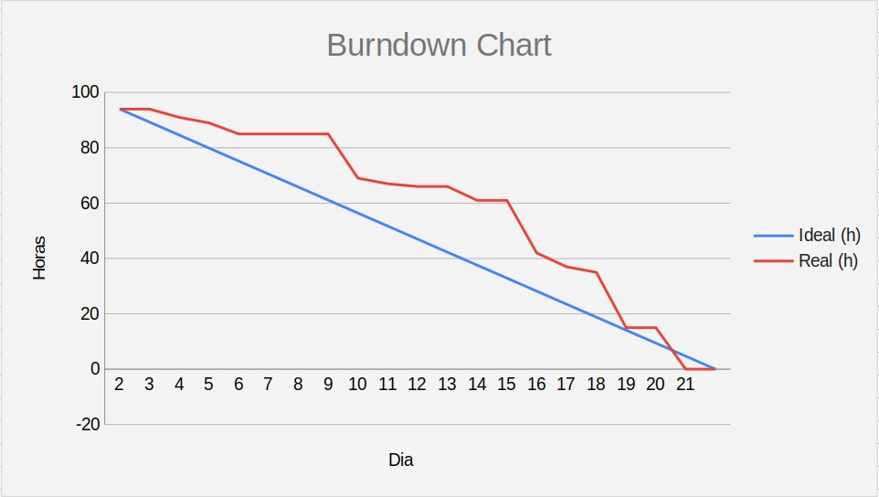

 
 
<h1 align="center"> SPRINT 2 :ballot_box_with_check: </h1>

    <a href="#mvp">MVP</a> | 
    <a href="#burndown">Burndown</a> | 
    <a href="#entrega">Entrega</a> | 

 
<h1> :rocket: MVP </h1>

Nesta sprint desenvolvemos o CRUD de Usuários, a tela de login com todas as permissões, inclusive recuperação de senha, e demos início à implementação do comitê de aprovação, introduzindo ao sistema a árvore de escalonamento.

  
  
 <h3 align="center"> WIREFRAME </h3>

  <h4>Usuários e Comitê de Aprovação</h2>
  
  
   
   &nbsp;
  
  <h4>Login</h2>
  <h1 align="center"></h1>

 

  <h3 align="center" id="diagramas"> DIAGRAMAS </h3>
<h1 align="center">

</h1>
 
  

 
## :pushpin: Burndown
<h1 align="center"> </h1>
 
 
  
 
 
## 👩‍💻 Entrega

 
 

 
   
  → [Voltar ao topo](#topo)
<h1 align="center"> 
<h5 align="center"> Projeto Integrador - Faculdade de Tecnologia de São José dos Campos - Prof. Jessen Vidal </h5>
